ASU Hackathon Instructions
================

You can train your inference models anywhere, deploy them locally as machine learning resources in a Greengrass group, and then access them from Greengrass Lambda functions. For example, you can build and train deep-learning models in Amazon SageMaker and deploy them to your Greengrass core.

Because our Robot is just a Greengrass core, we can use it to access ML models trained in SageMaker; deploy them to a RoboMaker Robot; and make them accessible to a ROS application.

Let's get started!
----

## Upload ML Models

As an object store, S3 provides the capability to store various types of data.  You're already using it to store a bundled ROS application.  Now you'll use it make ML models available to a robot using AWS Greengrass.

1. Locate the `best_steering_model_xy.pth` model

1. Create a zip archive of your ML models
    ```
    # Create a models folder and copy 
    $ mkdir ~/environment/models

    # Copy model files to the model directory
    $ cp /some/path/best_steering_model_xy.pth ~/environment/models

    $ cd ~/environment/models

    $ zip ../models.zip *

    ```

1. Copy the models.zip to S3
    ```
    $ aws s3 cp ~/environment/model.zip s3://<S3-BUCKET-NAME>/models.zip

    ```

## Create a Lambda function to Sync ML Models
Machine learning resources represent cloud-trained inference models that are deployed to an AWS IoT Greengrass core. To deploy machine learning resources, you will first define a Lambda functions to transfer the model to a location accessible by the ROS application and then add a resources to a Greengrass AWS group.


### Create a ML Model Sync function

1. Open the AWS Lambda console

    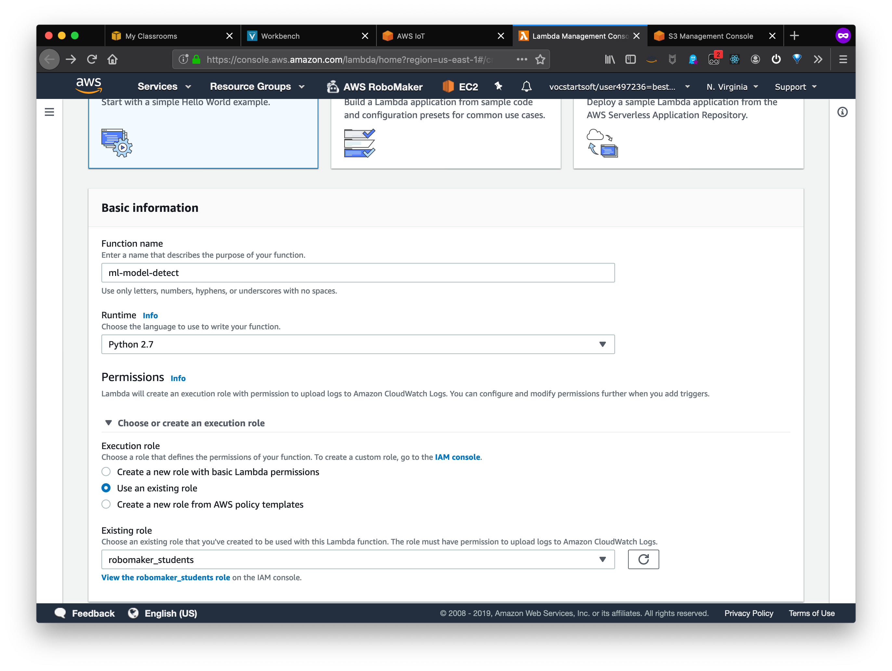

1. Press the **Create Function** button and add the following information:

    * **Function Name**: *choose a function name*
    * **Runtime**: Python 2.7
    Expand the choose or create an execution role
    * Select **Use an existing role** and select the role which is displayed

1. Choose **Create Function**

1. Open the AWS RoboMaker Cloud9 development environment in another tab and navigate to the `greengrass_model_sync/mlModelSync.py`

1. Copy the contents of this file and navigate back to the Lambda Function page

1. Paste the contents of the file into the **Function Code** block.

    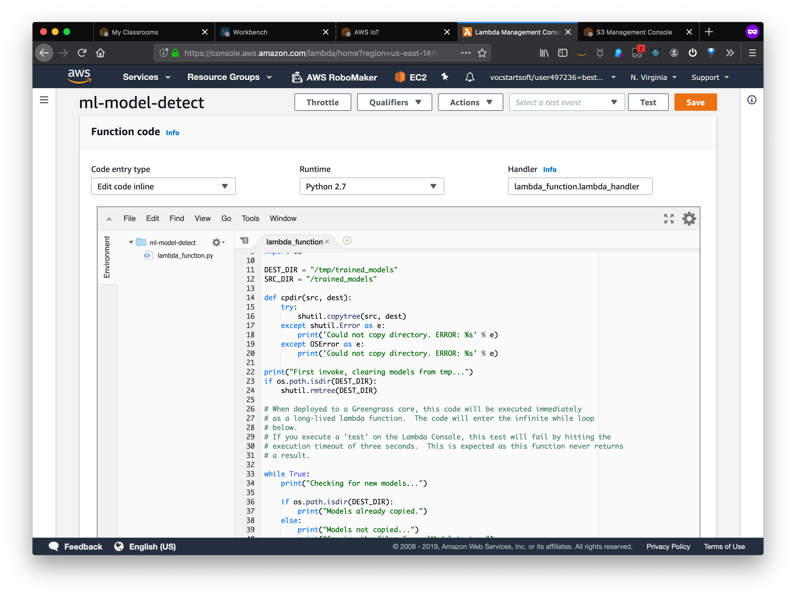

1. Click **Save**.

1. Under **Actions**, choose **Publish new version** and enter version **1**

    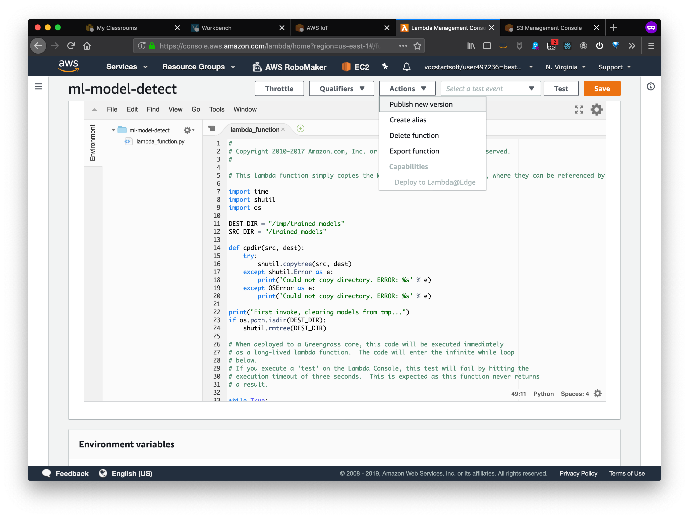

### Configure Greengrass to Sync ML Models

#### Add a Lambda function to a Greengrass group

1. Open the AWS Console and navigate to **IoT Core**

    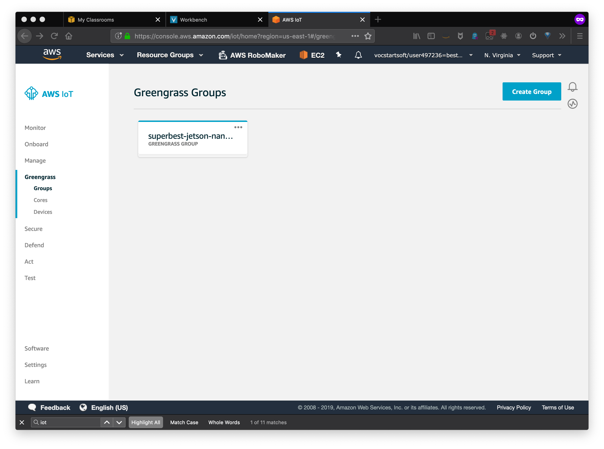

1. From the menu bar on the left side, select **Greengrass** > **Groups**, and click on the group corresponding to your Robot.

1. In the Greengrass Group view, select **Lambdas** from the menu

    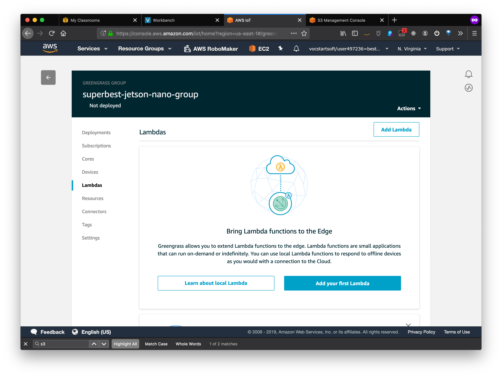

1. Click **Add Lambda** and add an existing lambda function.  Select the Lambda function created in the last step

1. Once the Lambda function is added, select the **Edit Configuration** in the upper right corner of the lambda function

1. Under **Lambda Lifecycle**, choose **Make this function long-lived and keep it running indefinitely** and **Update**

#### Add a ML Resource to a Greengrass group

1. From the menu bar on the left side, select **Greengrass** > **Groups**, and click on the group corresponding to your Robot.

1. In the Greengrass Group view, select **Resources** from the menu

1. Under **Resources**, choose **Machine Learning** > **Add a machine learning resource**

    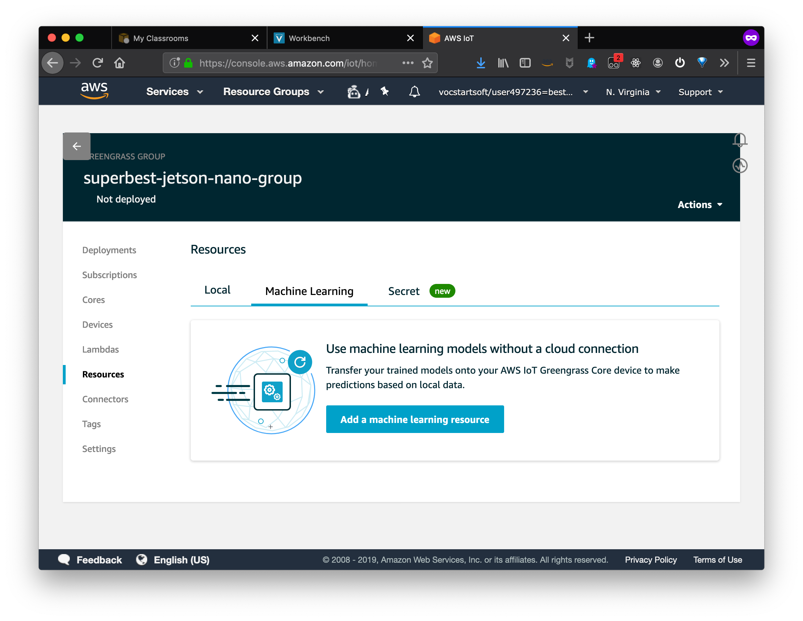

1. Use the following values to create the resource:
    * **Resource Name**: *select a resource name*
    * **Model Source**: Choose *Upload a model in S3*
      * Locate the Model in S3 in your <S3-BUCKET-NAME>
    * **Local Path**: */trained_models*
    * **Lambda function affiliations**: *select your ml model detect* function with **Read and write access**

    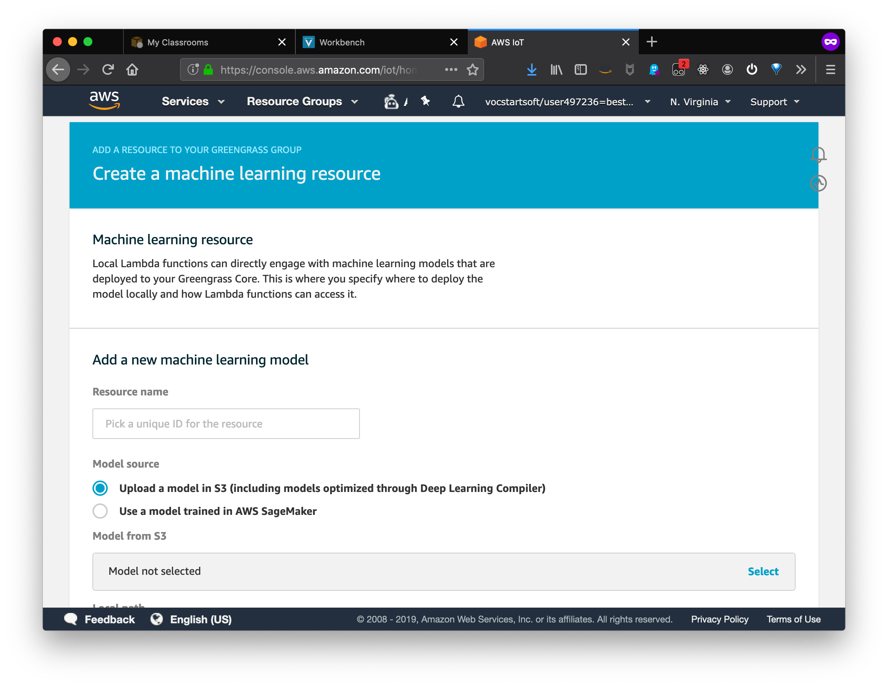

1. Choose **Save** 

#### Add a Local Resource to a Greengrass group
You can configure Lambda functions to securely access local resources on the host Greengrass core device. Local resources refer to buses and peripherals that are physically present on the host, or file system volumes on the host OS. For more information, including requirements and constraints, see Access Local Resources with Lambda Functions and Connectors.

1. From the menu bar on the left side, select **Greengrass** > **Groups**, and click on the group corresponding to your Robot.

1. In the Greengrass Group view, select **Resources** from the menu

    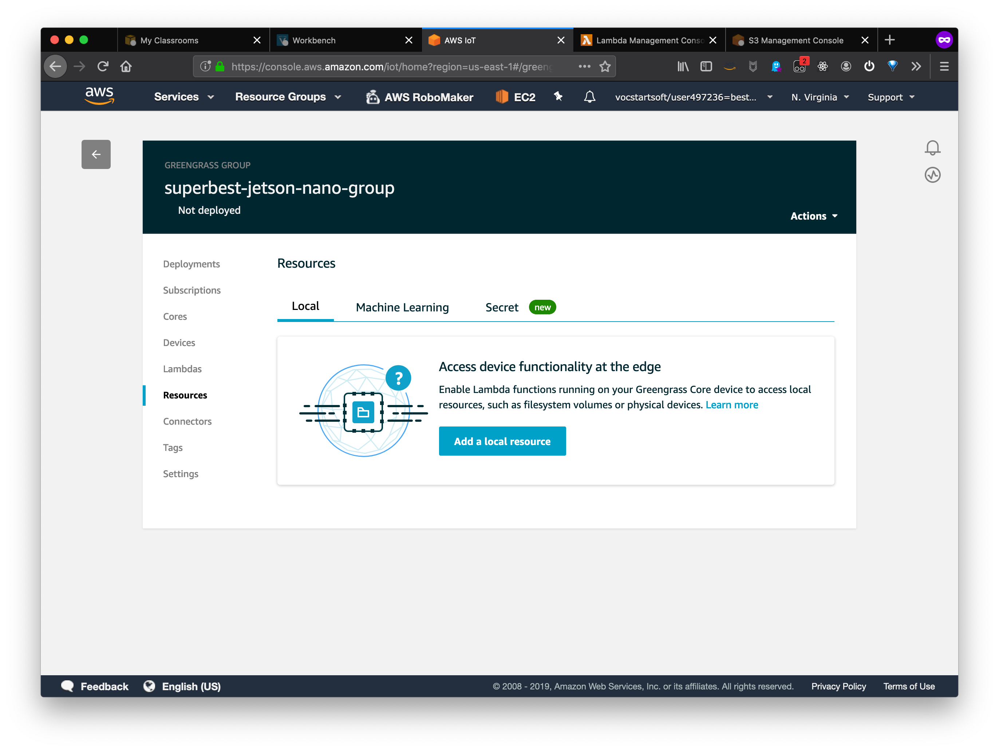

1. Under **Resources**, choose **Local** > **Add local resource**

    * **Resource name**: *select a resource name*
    * **Resource type**: *Volume*
    * **Source path**: `/tmp`
    * **Destination path**: `/tmp`
        *The destination path is the absolute path of the resource in the Lambda namespace. This location is inside the container that the function runs in.*

    * Under Group Owner file access permission
        * Select Automatically add OS group permissions of the Linux group that owns the resource.

    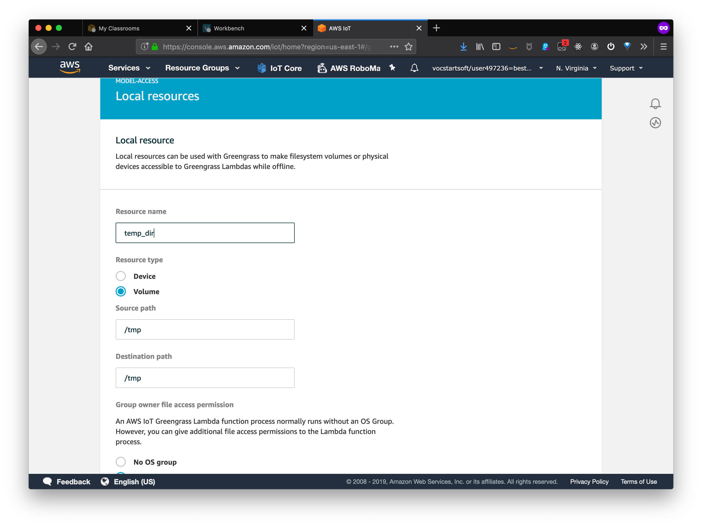

1. Click **Save**

#### Allowing Greengrass to access S3
Greengrass must be granted access to the S3 service.  This access is configured by adding a IAM Policy for the Greengrass service role.

1. From the AWS Management Console, navigate to the Identity and Access Management(IAM) service

1. Select **Roles** from the menu bar on the left side and search for **Greengrass_ServiceRole**.

    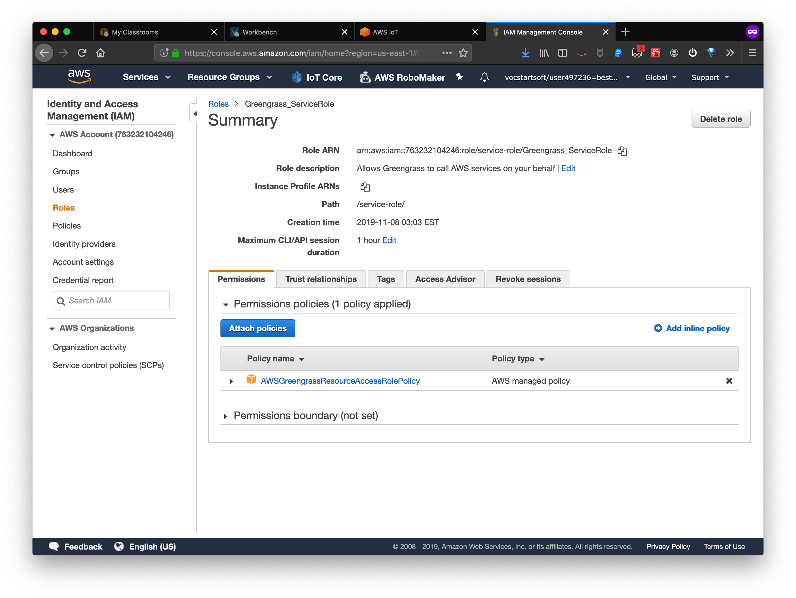

1. On the **Summary** view, click **Attach Policies** and search for **AmazonS3FullAccess**.

    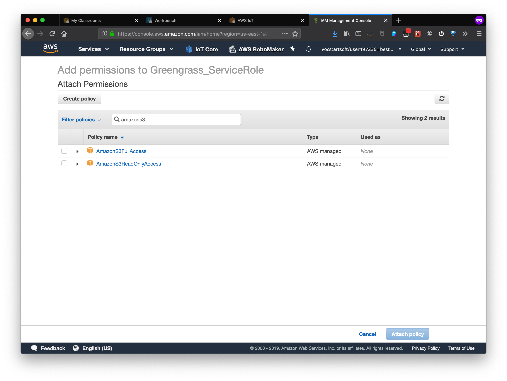

1. Click the check-box next to the name and select **Attach policy**.


#### Deploy the Greengrass Group

1. From the menu bar on the left side, select **Greengrass** > **Groups**, and click on the group corresponding to your Robot.

1. Select **Actions** > **Deploy**


The ML Models stored in S3 should now be syncing to the Robot.  Additionally, when these models are updated, they will be synced to the Robot.

Log in to the Robot and verify the ML models are being synced.

---

Now that ML models are being synced to the Robot, you'll deploy a ROS application to make use of the models. The ROS application built and bundled 
in the last module contained the necessary code to make use of this model.  You'll create a new deployment for your robot specifying a different launch file.


## Create a Deployment
1. Sign in to the AWS RoboMaker console at https://console.aws.amazon.com/robomaker/

1. In the left navigation pane, choose Fleet Management, and then choose Deployments.

1. Click Create deployment.

1. In the Create deployment page, under Configuration, select the Fleet created in the previous module.

1. Select the Robot application.

1. Select the Robot application version to deploy. The robot application must have a numbered `applicationVersion` for consistency reasons. If there are no versions listed, or to create a new version, see Creating a Robot Application Version.

1. Under Deployment launch config, specify the Package name: `jetbot-detect`

1. Specify the Launch file: `start_search.launch`
  
1. Environment variables, type in an environment Name and Value. Environment variable names must start with A-Z or underscore and consist of A-Z, 0-9 and underscore. Names beginning with “AWS” are reserved.

    - Add the following environment variables:
        - **Key** = `MOTOR_CONTROLLER` **Value** = `qwiic`

1. Specify a Robot deployment timeout. Deployment to an individual robot will stop if it does not complete before the amount of time specified.

1. Click **Create** to create the deployment job.


----

Congratulations, you're Robot is now running with ML inference models to provide it with the ability to take on more challenging tasks. Forward!
