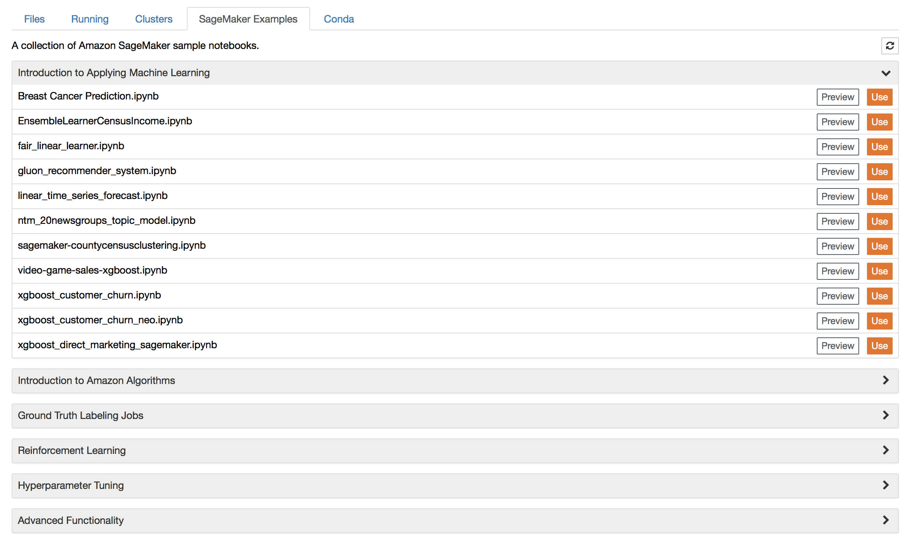

## Instructions to create SageMaker Notebook and upload sample notebooks

### Step 1: Create SageMaker Notebook:

### To create an Amazon SageMaker notebook instance

1. Open the Amazon SageMaker console at https://console.aws.amazon.com/sagemaker/home?region=us-east-1

2. Choose Notebook instances, then choose Create notebook instance.


On the Create notebook instance page, provide the following information:
- For Notebook instance name, type SageMakerWorkshop.
- For Instance type, choose ml.p3.2xLarge.
- For IAM role, create an IAM role.
- Choose Create a new role.


To access more S3 buckets from your Amazon SageMaker notebook instance
- choose Any S3 bucket

Choose Create role.
Amazon SageMaker creates an IAM role named AmazonSageMaker-ExecutionRole-YYYYMMDDTHHmmSS. For example, AmazonSageMaker-ExecutionRole-20171125T090800.

3. Choose Create notebook instance.
In a few minutes, Amazon SageMaker launches an ML compute instance—in this case, a notebook instance—and attaches an ML storage volume to it. The notebook instance has a preconfigured Jupyter notebook server and a set of Anaconda libraries. 

When the status of the notebook instance is InService, choose Open next to its name to open the Juypter dashboard.



The dashboard provides access to:

A new tab that contains sample notebooks. To use a sample notebook, on the "Sagemaker Examples" tab, choose the sample notebook you would like to explore. For information about the sample notebooks, see the Amazon SageMaker GitHub repository.

### Step 2: To upload sample notebooks
Use the following steps to clone the following file in your already created notebook instance:
- Go to Jupyter
- New > Terminal

```
cd SageMaker/

git clone https://github.com/mahendrabairagi/ASU_Hackathon

```
- Go to jupyter and open the newly downloaded ipynb notebook file by clicking 

"ASU_hackathon_train_mascot_model_resnet18.ipynb"

"ASU_hackathon_train_roadfollowing_model.ipynb"

### Step3: Using sample notebooks

To create new Road Following model, follow instruction on ASU_hackathon_train_roadfollowing_model notebook

To create new Mascot detection model, follow instruction on ASU_hackathon_train_mascot_model_resnet18 notebook


